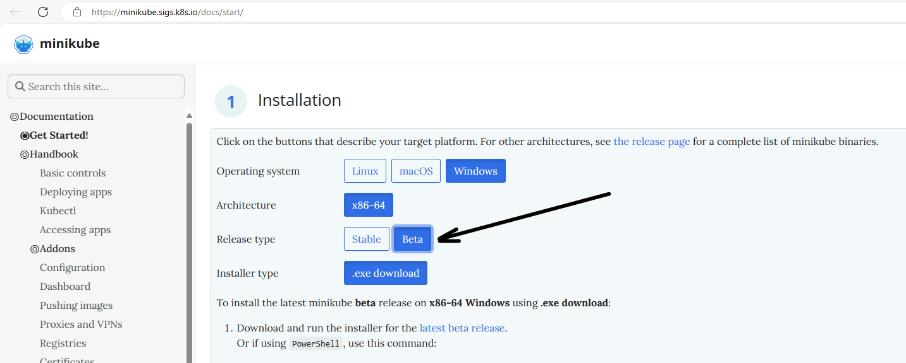

Накосячил с Liquibase, что делать?
- Удали все таблицы (вариант не очень грамотный, но самый простой). В терминале выполните команду <code>docker exec -it postgreS7 psql -h localhost -p 5432 -U root -W -d airline_db</code>, 
- введите пароль root  и нажвите enter, выполните команду <code>\dt</code>, чтобы увидеть все существующие таблицы. 
- Для манипулирования таблицами используйте стандартный SQL-синтаксис. 
- Чтобы удалить все таблицы, выполните команду <code>DROP SCHEMA public CASCADE;</code>, затем <code>CREATE SCHEMA public;</code>

Не работает FrontendApplication (airline-frontend http://localhost:8082/)?
- Отображается ошибка, в конце стектрейса <code>Caused by: java.util.zip.ZipException: zip END header not found</code>. У вас по какой-то неведомой причине не скачался артефакт, необходимый Vaadin'у для генерации фронта. Подложите его самостоятельно по пути <code>C:\Users\\{Ваш_Юзер}.vaadin\node-v18.16.0-win-x64.zip</code> (.vaadin - это скрытая папка), попросите коллегу отправить вам этот файл
- Проверить путь до проекта. В нем не должно быть кирилицы. Пример:
  C:\Users\pro10\Desktop\Проект\p_dp_airline_1   (Не верно)
  C:\Users\pro10\Desktop\Project\p_dp_airline_1  (Верно)
- Вместо фронта ошибка "Whitelabel Error Page", код 500, в конце стектрейса <code>java.util.zip.ZipException: zip END header not found</code>. Делаем следующие шаги: 1. В проводнике удаляем папку <code>C:\Users\\{Ваш_Юзер}\.vaadin</code>. 2. В IDEA в сервисе airline-frontend удаляем frontend, node_modules, target, package.json, package-lock.json, tsconfig.json, types.d.ts, vite.config.ts, vite.generated.ts. 3. В IDEA справа открываем вкладку Maven, в разделе Lifecycle запускаем clean, затем install. 4. По-окончанию запускаем сервис airline-frontend.

Ошибки при компиляции <code>cannot access...</code> или <code>cannot find symbol</code>
- Если не помогает <code>mvn clean install</code> корневого pom, попробуйте удалить папку .idea, затем в интерфейсе Идеи File -> Invalidate Caches...

Что делать, если в feign клиенте ошибка java.lang.IllegalStateException: PathVariable annotation was empty on param 0?
- Проверьте методы в Controllers. В аннотациях должно стоять имя параметра. Вот так: (@PathVariable("id") Long id);

### Minikube не видит локальные образы из Docker (<code>minikube image load airline-project</code> не работает)
### Вариант 1 (использовать другую версию minikube) (НЕАКТУАЛЬНО):
- Данная ошибка может происходить из-за выхода Docker 25, который не подходит для версии minikube 1.32 и ранее. На текущий момент есть бета версия minikube 1.33, доступная на [сайте](https://minikube.sigs.k8s.io/docs/start/).
  

### Вариант 2 (вытащить образ из докера):
- Установим дефолтный контекст у Docker <code>docker context use default</code>
- Выполним команду с указанием версии образа в Docker'е <code>minikube image load airline-project:latest</code>
- Если образ успешно загрузился, в описании Deployment модуля вместо "latest" указать версию образа из Docker

### Вариант 3 (собрать образ внутри Docker Kubernates)
В зависимотсти от командной оболочки и ОС вводим команду, которая все команды в сессии отправит в Docker Kubernetes

#### Windows

- PowerShell
  <code>& minikube -p minikube docker-env --shell powershell | Invoke-Expression</code>

- cmd
  <code>@FOR /f "tokens=*" %i IN ('minikube -p minikube docker-env --shell cmd') DO @%i</code>

#### Linux
- Bash <code>eval $(minikube docker-env)</code>

Затем собираем образ по Dockerfile (находясь в директории с Dockerfile_Project, иначе полный путь к файлу)
- <code>docker build Dockerfile_Project -t airline-project:latest</code>