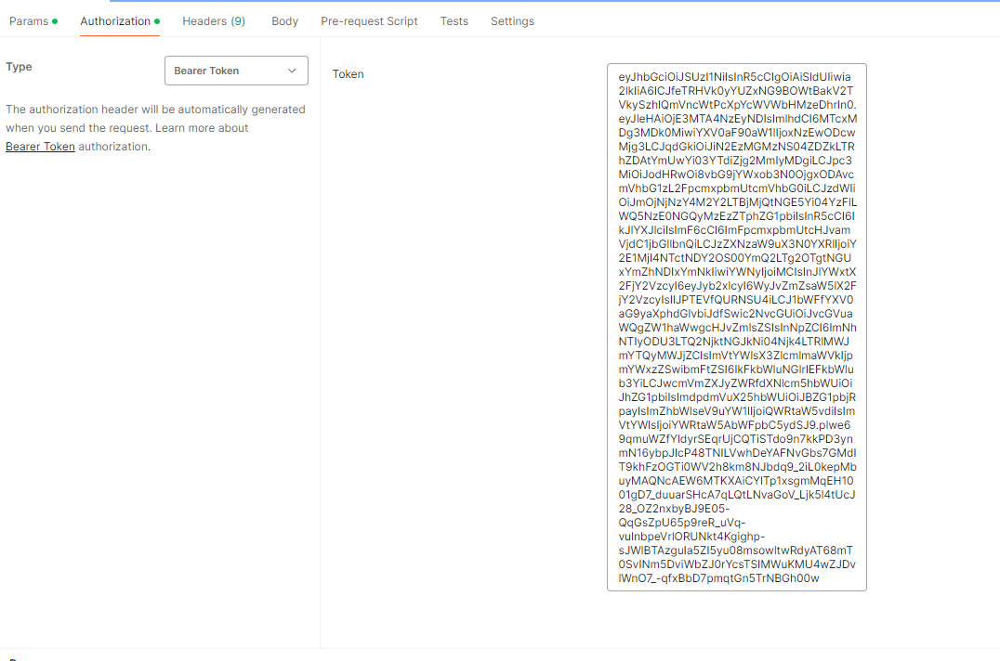
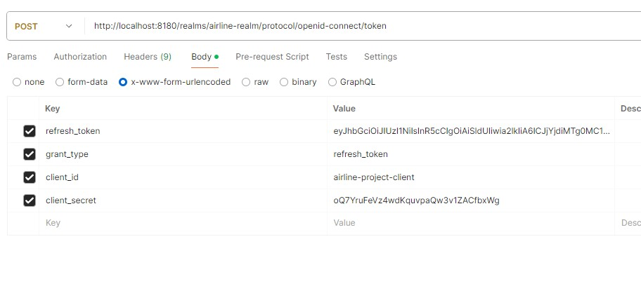

# Security

Для обеспечения безопасности и управления аутентификацией и авторизацией наше приложение использует Spring Security
который интегрирован с сервером авторизации Keycloak.
Конфигурация секьюрити находится в microservice-starter.

## Keycloak

Keycloak - это сервер аутентификации и авторизации. Иными словами, Keycloak - это приложение, которое запускается с остальными приложениями, разработчики которого за нас реализовали логику аутентификации и авторизации, нам лишь остается убедиться, что пользователь, делающий запрос к нашим приложениям, был аутентифицирован Keycloak'ом. Keycloak особенно важен в микросервисной архитектуре, так как если бы его не было, то нам пришлось бы самостоятельно писать приложение, выполняющее аналогичные функции.

При запросе к защищенному ресурсу, пользователя перебрасывает на страницу аутентификации в keycloak. После успешной аутентификации, keycloak выдает 
access token и refresh_token. [Token](https://habr.com/ru/articles/340146/) - это строка, которая содержит в себе всю информацию об авторизованном пользователе. При каждом запросе к нашему приложеню клиент должен передавать этот токен, и при его успешной проверке, мы пропускаем запрос дальше.

#### Основные термины:
- **Realm** - область для защиты, с возможность настройки со своими требованиями;
- **Client** - приложение или сервер, которые могут взаимодействовать с KeyCloak для аутентификации и авторизации;
- **Client scope** - область действия клиента. Позволяет управлять разрешениями для client. Информации об уровне доступа передается через JWT;
- **Users** - пользователи который могут пройти аутентификацию с помощью KeyCloak. Каждый User принадлежит определенной области, и иметь разные роли. Содержит такую информацию как username, firstname, lastname, email и так далее;
- **Groups** - группы, необходимые для упрощения управления доступом для большого количества пользователей. Способ сгруппировать набор пользователей и назначить им определенные атрибуты и роли.

### Запуск
В нашем проекте Keycloak запускается в docker контейнере вместе с базой данных командой <code>docker-compose -f docker-compose-kc.yml -p p_dp_airline_1 up</code>. (в дальнейшем вы можете запускать одновременно БД и Keycloak с помощью этого способа, а не способом, описанном в [guide_docker.md](guide_docker.md))
Консоль keycloak [тут](http://localhost:8180). Логин admin пароль admin.

База данных [заполнена](..%2Fairline-project%2Fsrc%2Fmain%2Fresources%2Fdb%2Fchangelog%2Fv-1.29%2F01-alter-table-account.sql) двумя пользователями: admin/admin и user/manager. Пользователи Keycloak - это наша сущность [Account](..%2Fairline-project%2Fsrc%2Fmain%2Fjava%2Fapp%2Fentities%2FAccount.java). Мы можешь добавлять и изменять пользователей через [AccountRestController](..%2Fairline-project%2Fsrc%2Fmain%2Fjava%2Fapp%2Fcontrollers%2Frest%2FAccountRestController.java).

> Чтобы keycloak мог использовать данные пользователей из нашей базы данных, написан keycloak provider который при сборке образа копируется в контейнер. Все основные настройки keycloak находятся в realm-export.json, при запуске контейнера файл импортируются в keycloak.

Чтобы получить токен, с помощью Postman сделать POST запрос на http://localhost:8180/realms/airline-realm/protocol/openid-connect/token 
в теле запроса передать данные как на скриншоте:
<code>grant_type:password
client_id:airline-project-client
username:admin
password:admin
client_secret:oQ7YruFeVz4wdKquvpaQw3v1ZACfbxWg</code>

Скопировать из ответа access_token и вставлять его при запросах к защищенным эндпоинтам. Время жизни токена 5 минут.
JWT токен содержит payload в котором могут передаваться данные пользователя, роли и тд. Декодировать токен можно [тут](https://jwt.io/).
Декодируя этот payload, наши приложения могут решить, что показывать пользователю. Например, проанализировав, что в payload содержится роль USER, приложение может
запретить пользователю удалять ресурсы.

Для получения нового токена, сделать запрос в котором передать refresh_token

# Дополнительные материалы
1. [Реализация JWT в Spring Boot](https://struchkov.dev/blog/ru/jwt-implementation-in-spring/);
2. Также под капотом KeyCloak использует OAuth 2.0 и OpenID Connect. [Как работает OAuth 2.0 и OpenID Connect](https://struchkov.dev/blog/ru/how-oauth2-works/);
3. [Введение в KeyCloak](https://www.youtube.com/watch?v=duawSV69LDI&list=WL&index=29&ab_channel=StianThorgersen)
4. [Spring boot 3 Keycloak integration for beginners](https://www.youtube.com/watch?v=vmEWywGzWbA&list=WL&index=29&ab_channel=BoualiAli);
5. [Реализация собственного провайдера](https://www.baeldung.com/java-keycloak-custom-user-providers)